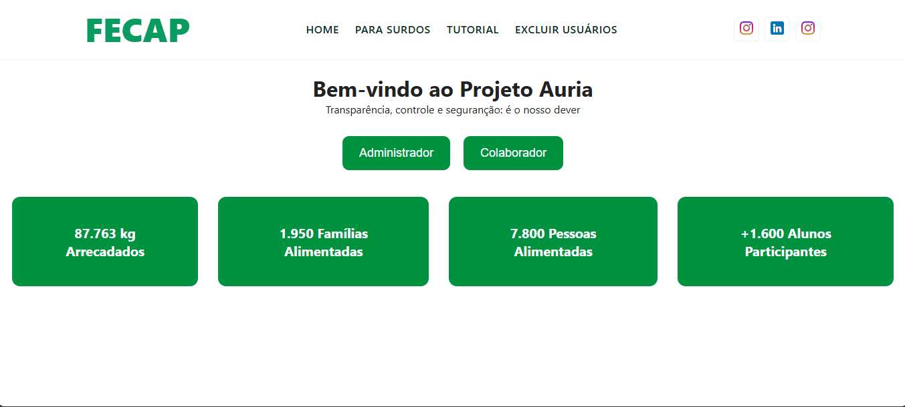

# FECAP - Fundação de Comércio Álvares Penteado

<p align="center">
<a href= "https://www.fecap.br/"></a>
</p>

# Lideranças Empáticas

## Auria

## Integrantes: <a href="https://github.com/Loreto1306">Artur Loreto</a>, <a href="https://github.com/EndrewFMA">Endrew Santos</a>, <a href="https://github.com/Archangeloo">Gustavo Archangelo</a>, <a href="https://github.com/Luiiz77">Luiz Antonio</a>, <a href="https://github.com/Mariana851">Mariana Almeida</a>

## Professores Orientadores: <a href="https://www.linkedin.com/school/fecap/posts/?feedView=all">Kátia Milani Lara Bossi</a>, <a href="https://www.linkedin.com/in/cristina-machado-corr%C3%AAa-leite-630309160/">Cristina Machado Correa Leite</a>, <a href="https://www.linkedin.com/in/francisco-escobar/">Francisco de Souza Escobar</a>, <a href="https://br.linkedin.com/in/dolemes">David de Oliveira Lemes</a>, <a href="https://www.linkedin.com/in/j%C3%A9sus-gomes-83b769108/">Jésus Gomes</a>
## Descrição

<p align="center">

  Site by <a href="Imagens/home_auria.png">Home page</a> <a rel="license" href="https://creativecommons.org/licenses/by/4.0/">CC BY 4.0</a> 
</p>


A plataforma de gestão desenvolvida,  busca oferecer ferramentas e recursos para que líderes e colaboradores possam aprimorar suas habilidades interpessoais, promover um ambiente de trabalho mais colaborativo e inclusivo, e tomar decisões que considerem o bem-estar e as perspectivas de todos os envolvidos. 
Através das funcionalidades do site, o Projeto Lideranças Empáticas pode gerenciar grupos de líderes e equipes, acompanhar o progresso de iniciativas de desenvolvimento empático, facilitar a comunicação e a colaboração entre os participantes, e até mesmo utilizar o módulo de inteligência artificial para analisar o engajamento e o impacto das ações de liderança, tornando a gestão e a expansão da iniciativa mais eficientes e transparentes.

## 🛠 Estrutura de pastas

- Raiz  
&emsp;|--> Documentos  
&emsp;&emsp;|--> Entrega 1  
&emsp;&emsp;&emsp;|--> Calculo II  
&emsp;&emsp;&emsp;&emsp;|--> 1 Entrega_Cálculo II.pdf  
&emsp;&emsp;&emsp;|--> Desenvolvimento Web Full Stack  
&emsp;&emsp;&emsp;&emsp;|--> Backend  
&emsp;&emsp;&emsp;&emsp;|--> Frontend  
&emsp;&emsp;&emsp;&emsp;|--> Auriafinal.mp4  
&emsp;&emsp;&emsp;&emsp;|--> Link Acesso Frontend.txt  
&emsp;&emsp;&emsp;&emsp;|--> Link BackEnd.txt  
&emsp;&emsp;&emsp;|--> Gestão Empresarial e Dinâmica das Organizações  
&emsp;&emsp;&emsp;&emsp;|--> Entrega 1 - Gestão Empresarial  
&emsp;&emsp;&emsp;|--> Projeto Interdisciplinar - Programação Web  
&emsp;&emsp;&emsp;&emsp;|--> Link Figma.txt  
&emsp;&emsp;&emsp;|--> Projeto em Banco de Dados  
&emsp;&emsp;&emsp;&emsp;|--> Entrega DB.draw.io  
&emsp;&emsp;|--> Documento - Projeto Extensão COM empresa Auria.docx  
&emsp;|--> Imagens  
&emsp;&emsp;|--> home auria.png  
&emsp;|--> SRC  
&emsp;&emsp;|--> Entrega 1  
&emsp;&emsp;&emsp;|--> Backend  
&emsp;&emsp;&emsp;|--> Frontend  
&emsp;|--> .gitignore  
&emsp;|--> README.md  


A pasta raiz contem dois arquivos que devem ser alterados:

<b>README.MD</b>: Arquivo que serve como guia e explicação geral sobre seu projeto. O mesmo que você está lendo agora.

Há também 4 pastas que seguem da seguinte forma:

<b>documentos</b>: Toda a documentação estará nesta pasta.

<b>executáveis</b>: Binários e executáveis do projeto devem estar nesta pasta.

<b>imagens</b>: Imagens do sistema

<b>src</b>: Pasta que contém o código fonte.

## 🛠 Instalação


<b>HTML:</b>

Não há instalação!
Para ter acesso ao site, utilize o link https://auria-pro.netlify.app/.

## 💻 Configuração para Desenvolvimento


Para abrir este projeto você necessita das seguintes ferramentas:

<b>Frontend e Backend<b/>

<a href="https://www.nodejs.tech/pt-br/download">Node.js</a>, <a href="https://code.visualstudio.com/download">VS Code</a>, <a href="https://dev.mysql.com/downloads/workbench/">MySQL Workbench</a>.

Para o <b>Frontend<b/>, navegue o seguinte caminho: <b>documentos/Entrega 1/Desenvolvimento Web FullStack/Frontend<b/>, e faça o dowload da pasta em ZIP. Após o dowload, abra a pasta pelo Vscode, abra o terminal (CRTL + ") e digite os seguintes comandos, na sequência
```sh
npm install
```
e Por fim,

```sh
npm run dev
```
Feito os comandos, ele abrirá um link para o direcionamento do site (http://localhost:5173/)

Para o <b>Backend<b/>, navegue pelo seguinte caminho:<b>documentos/Entrega 1/Desenvolvimento Web FullStack/Frontend<b/>, e faça o dowload da pasta em ZIP. Após o dowload, abra a pasta pelo Vscode, abra o terminal (CRTL + ") e digite os seguintes comandos, na sequência

```sh
Set-ExecutionPolicy RemoteSigned -Scope CurrentUser
```
Posteriormente, instale as pendências:

```sh
npm install
```
Por fim,

```sh
cd Backend
npm start
```


## 📋 Licença/License
<a href="https://creativecommons.org">Auria</a> © 2025<a href="https://creativecommons.org"></a> is licensed under <a href="https://creativecommons.org/licenses/by/4.0/">CC BY 4.0</a>

## 🎓 Referências

Aqui estão as referências usadas no projeto.

1. <https://github.com/iuricode/readme-template>
2. <https://github.com/gabrieldejesus/readme-model>
3. <https://chooser-beta.creativecommons.org/>
4. <https://freesound.org/>
5. <https://www.toptal.com/developers/gitignore>
6. Músicas por: <a href="https://freesound.org/people/DaveJf/sounds/616544/"> DaveJf </a> e <a href="https://freesound.org/people/DRFX/sounds/338986/"> DRFX </a> ambas com Licença CC 0.
